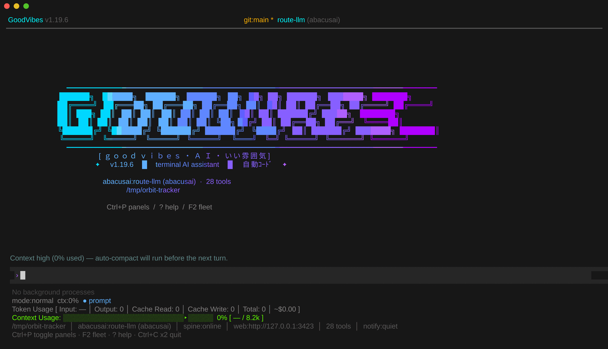
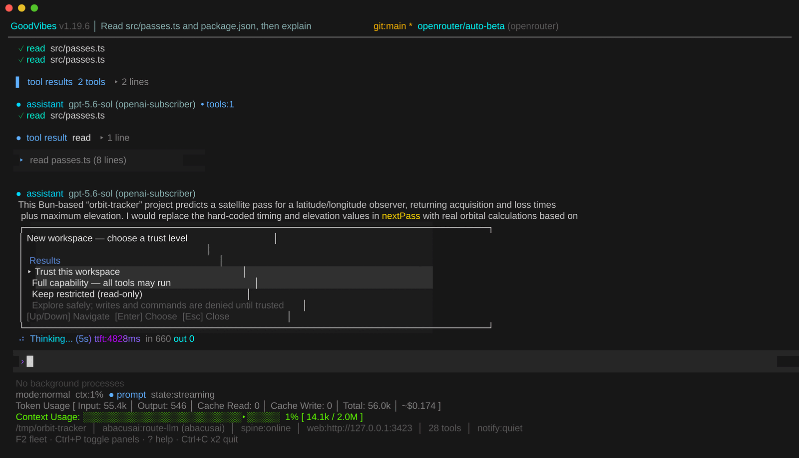
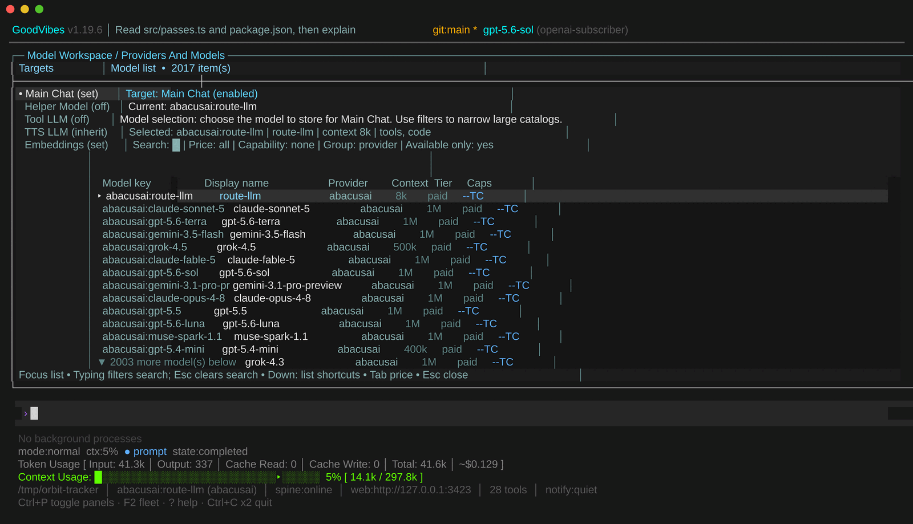

# goodvibes-tui

[](https://github.com/mgd34msu/goodvibes-tui/actions/workflows/ci.yml)
[](https://opensource.org/licenses/MIT)
[](https://github.com/mgd34msu/goodvibes-tui)

GoodVibes is a terminal console for coding and operations work with an AI model. You run `goodvibes` in a project directory and get a full-screen terminal app where you talk to a model that can read and edit your files, run shell commands, search the web, and hand work off to background agents — asking your permission before anything that writes or executes. It talks to many model providers (OpenAI, Anthropic, Gemini, Bedrock, Copilot, OpenRouter and other OpenAI-compatible gateways, plus local servers like Ollama and LM Studio that it finds on startup), keeps its settings, sessions, and secrets on your own machine, and shows you the token count and running cost of every turn. Alongside the conversation, panels turn background work — running agents, git state, diffs, tokens, cost — into live control rooms.



---

## Install

GoodVibes runs on Linux, macOS, and Windows via WSL2. The one-line installer downloads checksum-verified binaries and needs no package manager:

```sh
curl -fsSL https://goodvibes.sh/install.sh | sh
goodvibes
```

Or install from the npm registry with [Bun](https://bun.sh):

```sh
bun add -g @pellux/goodvibes-tui
bun pm trust -g @pellux/goodvibes-tui
goodvibes
```

Bun blocks lifecycle scripts for untrusted global packages, so the second line lets the package's postinstall place the matching TUI and daemon binaries. Only `@pellux/goodvibes-tui` itself needs trusting — no dependency does. If you skip that step, the `goodvibes` launcher still self-heals on first run by fetching and checksum-verifying the binaries. `npm install -g @pellux/goodvibes-tui` also works when `bun` is already on `PATH`.

Then point it at a model — an environment variable is the fastest path:

```sh
export OPENAI_API_KEY=...
```

On Windows, run it inside a WSL2 distribution, where it is an ordinary Linux install. Native Windows is beta — see [docs/windows.md](docs/windows.md).

Deeper install notes — the installer's environment variables, uninstall, daemon service registration, encrypted and vault-backed secrets, and running from source — are in [docs/getting-started.md](docs/getting-started.md).

---

## A 60-second tour

### The conversation loop


Tool calls stream inline as the model makes them, then their results fold into a collapsible group so a long working session stays readable — expand any group to see what actually came back. Assistant messages render markdown, syntax-highlighted code, and inline diffs, and any block can be collapsed, bookmarked, copied, or saved to a file.

The footer keeps an honest running total: fresh input tokens separated from cache reads, output tokens, the estimated cost so far, and how much of the context window is used. When a model's price is not in the catalog, the cost is reported as unavailable rather than guessed.

### Permissions and workspace trust



The first time you open a directory, GoodVibes asks how much it is allowed to do there. Restricted is read-only: the model can look around, but writes and commands are refused until you trust the workspace.


After that, the default permission mode is `prompt`: writes, edits, shell commands, network fetches, agent spawns, and MCP calls each stop and ask. The prompt shows what will run, in which directory, its assessed risk, and what it can affect. You can allow it once, deny it (optionally typing a reason the model sees), or remember the decision at whichever scope fits — this exact command, this command shape, this tool for the whole project, or just for the rest of the session. Four other modes are available when prompting is not what you want: `accept-edits` auto-approves file writes and edits while exec and the other risky classes still ask, `plan` allows read-only tools and refuses every mutating or exec call, `allow-all` approves everything, and `custom` takes per-tool `allow` / `prompt` / `deny` overrides. `Shift+Tab` cycles the four session postures — normal, accept-edits, plan, auto — and `/plan` toggles plan mode directly.

### Models and providers



Models come from a live catalog, so the picker lists far more than a hardcoded set, filterable by search, price, capability, and availability. Separate roles route independently: your main chat model, a cheaper helper model for grunt work, a tool model, a TTS model, and an embeddings model can each point somewhere different.

The `synthetic` provider groups the same model across every backend that serves it into one entry. Pick it and requests route to whichever backend is healthy, failing over on rate limits and transient errors without changing the model you chose — and without ever crossing the free, paid, and subscription boundaries. Any OpenAI-compatible API can be added as a custom provider by dropping a JSON file in `~/.goodvibes/tui/providers/`; it is hot-reloaded. See [docs/providers-and-routing.md](docs/providers-and-routing.md).

### The Fleet control room


Work that is not conversation goes into panels instead of scrolling past in the transcript. Fleet — reached with `F2` — is the live control room for agents, workstreams, watchers, and scheduled jobs: what is running, for how long, at what token cost, and what it is waiting on. You can attach to a running agent to watch or steer it, detach again without killing it, pause and resume, and archive finished work. Git, diff, cost, token, and local-auth panels sit alongside it; heavier operator surfaces open as review modals.

### Everything else is a command


Press `?` for a searchable, categorized list of every slash command with its arguments and description. The same list is generated into [docs/commands-reference.md](docs/commands-reference.md).

### Keys worth knowing on day one

| Key | Does |
| --- | --- |
| `Enter` / `Shift+Enter` | Send the message / insert a newline |
| `?` | Help and command picker (on an empty prompt) |
| `@` | File picker — insert a path into the prompt |
| `Tab` | Toggle collapse on the nearest block, or complete a path |
| `Ctrl+F` | Search the conversation |
| `Ctrl+Y` / `Ctrl+S` | Copy / save the nearest block |
| `Ctrl+P` | Toggle the panel sidebar |
| `F2` | Toggle Fleet — open and focus it, bring it to front, or close it |
| `Ctrl+K` | Command palette — search and run any command |
| `Shift+Tab` | Cycle the session permission mode |
| `Esc` | Leave the current mode — search, command, or modal |
| `Ctrl+C` | Clear input, cancel a running turn; press twice to quit |

Most bindings are customizable in `~/.goodvibes/tui/keybindings.json`, and `/keybindings` shows what is currently bound. Five keys are fixed and stay out of that file: `F2`, `Shift+Tab`, `Esc`, `?`, and `@`. The full reference is in [docs/tools-and-commands.md](docs/tools-and-commands.md).

---

## What's in the box

Each row links to the page that documents it. The product's own `?` overlay and `/help` are always the current authority.

| Area | What you get | Docs |
| --- | --- | --- |
| Models and routing | Native, OpenAI-compatible, and gateway providers; local inference-server discovery; synthetic failover groups; per-role model targets; custom provider JSON | [providers-and-routing.md](docs/providers-and-routing.md) |
| Tools | File read/write/edit/find, shell exec, fetch, web search, code analysis and inspection, agents, workflows, bounded REPL/query runtimes | [tools-and-commands.md](docs/tools-and-commands.md) |
| Slash commands | The full generated command reference, by category | [commands-reference.md](docs/commands-reference.md) |
| Keyboard | The complete binding reference, and how to rebind | [tools-and-commands.md](docs/tools-and-commands.md) |
| Agents and workflows | Built-in and custom archetypes, spawning, git worktree isolation, automation and scheduled jobs | [tools-and-commands.md](docs/tools-and-commands.md) |
| Extending it | Hooks and hook chains, the plugin manifest and API, MCP servers, the curated marketplace | [tools-and-commands.md](docs/tools-and-commands.md) |
| Diagnostics | Evaluation suites, deterministic replay, incident bundles, the state inspector, telemetry | [tools-and-commands.md](docs/tools-and-commands.md) |
| CLI flags | Session lifecycle (`--continue`, `--resume`, `--fork`), non-interactive mode, output formats, host selection | [cli-flags.md](docs/cli-flags.md) |
| Knowledge and memory | Session and durable memory, a structured knowledge store with connectors and extractors, embeddings and retrieval, artifacts, multimodal analysis | [knowledge-artifacts-and-multimodal.md](docs/knowledge-artifacts-and-multimodal.md) |
| Session durability | Post-turn snapshots plus an fsync-per-record transcript journal replayed at every resume | [session-durability.md](docs/session-durability.md) |
| Planning | Conversational planning loop, project-scoped knowledge spaces, readiness evaluation, the Planning panel | [project-planning.md](docs/project-planning.md) |
| Sharing and export | `/share` to HTML, JSON, or Markdown with redaction, upload, and clipboard options | [share-command.md](docs/share-command.md) |
| Daemon and services | TUI-only or in-process daemon, headless daemon/API host, browser operator surface, background service and autostart, inbound TLS, outbound trust | [deployment-and-services.md](docs/deployment-and-services.md) |
| Remote access | A worked home-server setup: always-on daemon, browser access, TUI over SSH, reachability and TLS | [remote-access.md](docs/remote-access.md) |
| Channels and API | Slack, Discord, Telegram, Matrix, webhook and other surfaces; the shared reply pipeline; remote peers and node hosts; the control-plane HTTP and streaming API | [channels-remote-and-api.md](docs/channels-remote-and-api.md) |
| Voice | Live `/tts` playback, TTS and STT providers, streaming voice API | [voice-and-live-tts.md](docs/voice-and-live-tts.md) |
| Sandboxing | Bounded eval and isolated MCP execution, with a QEMU-backed VM path | [qemu-sandbox.md](docs/qemu-sandbox.md) |
| Integrations | Home Assistant surface, Cloudflare Workers/Queues batch, GitHub Action | [homeassistant-surface.md](docs/homeassistant-surface.md) · [cloudflare-batch.md](docs/cloudflare-batch.md) · [github-action.md](docs/github-action.md) |
| Contributing surfaces | Writing a new TUI panel; the checked-in operator/peer contracts and knowledge schemas | [panel-authoring.md](docs/panel-authoring.md) · [foundation-artifacts](docs/foundation-artifacts/README.md) |

Full index: [docs/README.md](docs/README.md).

---

## Configuration

Settings are layered. Later layers win:

1. built-in defaults
2. global settings — `~/.goodvibes/tui/settings.json`
3. project overrides — `.goodvibes/tui/settings.json`
4. CLI and runtime overrides

Edit them live with `/settings` or the fullscreen `/config` workspace rather than by hand. A few of the most-reached-for keys:

| Key | Default | What it does |
| --- | --- | --- |
| `permissions.mode` | `prompt` | `prompt`, `accept-edits`, `plan`, `allow-all`, or `custom` (per-tool overrides) |
| `provider.model` | `openrouter:openrouter/free` | Active model for main chat |
| `provider.reasoningEffort` | `medium` | Reasoning depth on models that support it |
| `display.theme` | `vaporwave` | Color theme |
| `display.stream` | `true` | Stream responses token by token |
| `display.lineNumbers` | `off` | Line numbers: `off`, `code`, or `all` |
| `display.showThinking` | `false` | Show model thinking traces |
| `behavior.autoCompactThreshold` | `80` | Context percentage before auto-compact runs |
| `helper.enabled` | `false` | Route grunt work to a cheaper helper model |
| `daemon.enabled` | `true` | Run the local session daemon, bound to loopback |

The wider key table, the permission modes, and the hand-edited TUI namespaces (checkpoint root guard, scriptable statusline, session behavior, launch-time self-update) are in [docs/configuration.md](docs/configuration.md).

### Where things are stored

- global settings `~/.goodvibes/tui/settings.json`, project settings `.goodvibes/tui/settings.json`
- encrypted secrets `~/.goodvibes/tui/secrets.enc` or `.goodvibes/tui/secrets.enc`
- custom providers `~/.goodvibes/tui/providers/*.json`, keybindings `~/.goodvibes/tui/keybindings.json`
- service registry `.goodvibes/tui/services.json`, schedules `.goodvibes/tui/schedules.json`
- agent archetypes `.goodvibes/agents/*.md`, MCP servers `.goodvibes/mcp.json`, hooks `.goodvibes/hooks.json`
- sessions, artifacts, and other project runtime state under `.goodvibes/` in the working directory

---

## A note on cost

Free-tier synthetic models can cascade to the next-best free model when every backend for the current one is exhausted, and free, paid, and subscription tiers are never mixed. This system is not perfect, and there are ways it could result in charges accruing.

This includes but is not limited to when a provider moves a model from free to paid and you have kept the session running for longer than 24 hours without refreshing the model list. The system will not know that the model is now a paid model.

Refreshes happen automatically when a new session is started or resumed after the 24-hour catalog TTL expires. For long-running sessions, please ensure that the models are refreshed daily.

Paid and subscription models never auto-switch to a different model — that choice stays yours. When one is exhausted, GoodVibes says so and offers to wait out the cooldown, change model, or move to a free synthetic model. Full failover behavior: [docs/providers-and-routing.md](docs/providers-and-routing.md).

---

## Development

```sh
git clone https://github.com/mgd34msu/goodvibes-tui.git
cd goodvibes-tui
bun install
bun run dev
```

| Command | Does |
| --- | --- |
| `bun run dev` | Run the TUI from source |
| `bun run daemon` | Run the headless daemon/API host from source |
| `bun test` | Run the suite through the parallel per-file runner |
| `bun run build` | Compile `src/main.ts` into `dist/goodvibes` |

The compiled binary is the TUI entrypoint; it also hosts the daemon in-process (`daemon.enabled`, on by default, loopback-bound) and the HTTP listener when `danger.httpListener` is enabled.

Tests live under `src/test/`, mirroring the source tree, and cover contract, security, release-gate, runtime, renderer, panel, integration, and anti-regression cases. Several gates run alongside them in CI: byte-exact golden renderer frames, performance budgets for startup and frame composition and line production (`scripts/perf-baseline.json`), and architecture rules for import cycles, layer boundaries, source-file size, and unused renderer exports (`scripts/check-architecture.ts`).

Some decisions worth knowing before you read the source:

- **Bun runtime** — native TypeScript execution, fast startup, built-in test runner.
- **Raw ANSI renderer** — the UI is written straight to the alternate screen buffer, giving direct control over every byte sent to the terminal. Conversation, panels, modals, overlays, and the footer all share that one renderer.
- **In-process agents** — agents run in the same process rather than over IPC, staying isolated through scoped tool registries and namespaced state.
- **Typed runtime store** — a plain `zustand/vanilla` store with typed selectors and dispatch paths, reachable from agents, tools, renderer, hooks, channels, and daemon surfaces alike.
- **Tree-sitter and bundled language servers** — grammars for structural analysis, outlines, and AST-level edits, several embedded as WASM for instant startup; TypeScript, Python, Bash, CSS, HTML, and JSON language servers ship as dependencies, while `rust-analyzer` and `gopls` are fetched on first use with checksum verification.
- **Backend-first external surface** — the daemon and control plane expose typed HTTP and gateway methods, so other clients do not reimplement runtime logic.
- **Crash recovery** — periodic snapshots plus an fsync-per-record append-only transcript journal, replayed at every resume seam.
- **Render coalescing and a per-message line cache** — same-tick render requests collapse into one composite frame, and transcript growth re-renders only the appended message instead of rebuilding the whole conversation.

The TUI consumes the published `@pellux/goodvibes-sdk` platform layer — pinned in `package.json` — for shared contracts, daemon routes, and transports, and keeps the terminal UI, host wiring, and product composition here. Reference consumers of those surfaces live under [`examples/`](examples/reference-operator-client/README.md).

Source layout, in brief:

```text
src/
├── main.ts, core/          terminal entrypoint, orchestrator, conversation and transcript state
├── renderer/               raw ANSI compositor, overlays, modals, fullscreen workspaces
├── panels/                 panel manager, the Fleet control room, git/diff/cost/token consoles
├── input/                  slash commands, keybindings, composer, pickers, settings modals
├── runtime/                bootstrap wiring, typed store, service composition, session recovery
├── shell/                  shell-level modal openers, blocking input, retry affordances
├── config/                 settings layering, surface roots, secrets, credential availability
├── permissions/            approval cards, hunk selection, sandbox exec gate
├── cli/                    flag parsing, management verbs, doctor, launch-time self-update
├── daemon/                 daemon CLI, lifecycle, request handlers, service commands
├── tools/, mcp/, plugins/  TUI-local tool guards, MCP hot reload, plugin loader
├── audio/, export/         turn playback and speech routing, cost pricing and gist upload
├── verification/, work-plans/, widget/    live verifier and ledger, work-plan store, widget module
├── utils/, types/, scripts/               formatting and clipboard helpers, local types, message script
└── test/                   the suite, mirroring the tree above
```

---

## Stability

From 1.0.0 the project follows semver: incompatible changes to CLI flags, config keys, slash commands, key bindings, daemon routes, and on-disk layouts land only in major releases, and deprecations are noted in [CHANGELOG.md](CHANGELOG.md) first. Documentation always describes the **current** behavior, not historical behavior.

## License

MIT
